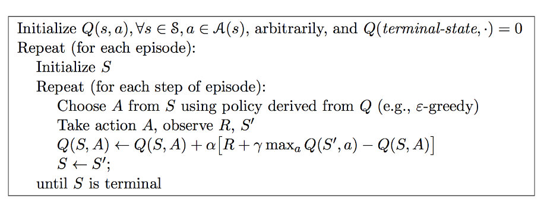

# BlackJack Casino Game

## 1. Introduction

This the basic implementation of the BlackJack Game environment and Agent find the optimal policy to play this game.

## 2. BlackJack environment

    This environment is taken from the book Reinforcement Learning: An Introduction
    by Richard S. Sutton and Andrew G. Barto 2014, 2015.
    
    Action space : [Hit, Stick] 
    Environment observations : [Usable ace, done] 
    1. Blackjack is a card game where the goal is to obtain cards that sum to as
    near as possible to 21 without going over. They're playing against a fixed
    dealer.

    2. Face cards (Jack, Queen, King) have point value 10. 
    
    3. Aces can either count as 11 or 1, and it's called 'usable' at 11.
    
    4. This game is placed with an infinite deck (or with replacement).
    
    5. The game starts with each (player and dealer) having one face up and one
    face down card.
    
    6. The player can request additional cards (hit=1) until they decide to stop
    (stick=0) or exceed 21 (bust).
    
    7. After the player sticks, the dealer reveals their facedown card, and draws
    until their sum is 17 or greater.  If the dealer goes bust the player wins.
    
    8. If neither player nor dealer busts, the outcome (win, lose, draw) is
    decided by whose sum is closer to 21.  The reward for winning is +1,
    drawing is 0, and losing is -1.
    
    9. The observation of a 3-tuple of: the players current sum,
    the dealer's one showing card (1-10 where 1 is ace),
    and whether or not the player holds a usable ace (0 or 1).

for more information watch youtube video:
<https://www.youtube.com/watch?v=eyoh-Ku9TCI>

### Environment Returns

    return {'pCards', 'nState', 'dealers_cards', 'dealers_score', 'action', 'reward', 'done'}

    nState : Next state of the agent.
    reward :  (-1, 0, 1).
    done : False / True, if game over for player then True otherwise False.
    pCard : cards player have in hand.
    dealers_cards : cards dealer have.
    dealers_score : score of the dealer i.e. sum of cards.

## 3. Agent Implementation

### 3.1 Monte Carlo Model Free

State-Action (Sₜ, Aₜ) Value evaluation for  each episode.

ε-Greedy policy Improvement

##### Q values convergence (RESULTS)

### 3.2 Temporal Difference Learning

The TD method has the characteristics of low variance, online learning, and can learn incomplete sequences, so TD can be used instead of MC for more effective learning.

𝜖−𝑔𝑟𝑒𝑒𝑑𝑦 is used as The strategy is optimized, and the Q value is updated at each time step.

##### SARSA Algorithm

##### SARSA Results

### 3.3 Off Policy Q Learning

Off-policy refers to interacting with the environment through the 𝜇 strategy (performance strategy), obtaining the sequence of S, A, R as experience, and using the experience to evaluate and optimize the learning method of another strategy 𝜋.

##### Off Policy Q Learning Algorithm

##### Results

## 4 References

1. Richard S. Sutton and Andrew G. Barto Ⓒ 2014, 2015

2. David Silver youtube videos : <https://www.youtube.com/playlist?list=PLqYmG7hTraZDM-OYHWgPebj2MfCFzFObQ>

3. Steve Brunton lectures <https://www.youtube.com/playlist?list=PLMrJAkhIeNNQe1JXNvaFvURxGY4gE9k74>
